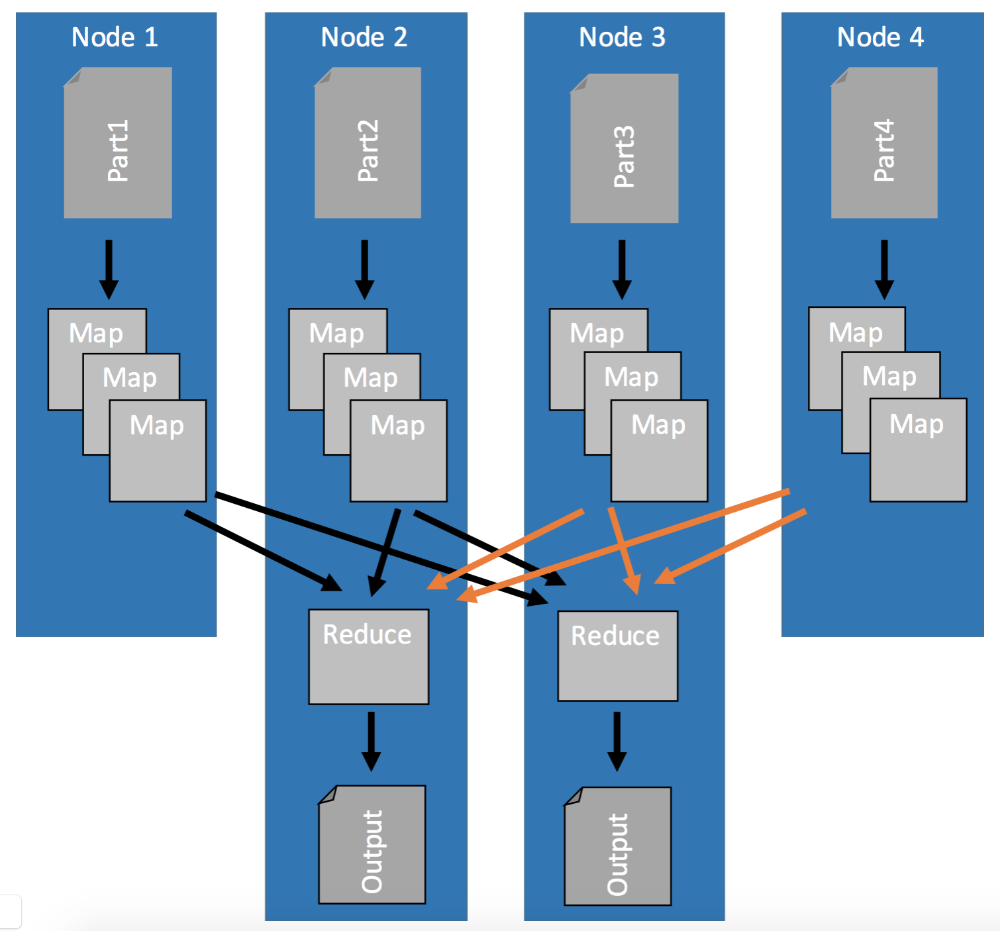

# 第二部分 数据工程基本技能（第20节 ~ 第30节）

## 20. 数据处理以及数据分析框架

### 20.1 ETL是否仍然与数据分析相关？

（表 20.1）

### 20.2 流处理

#### 20.2.1 流处理的三种方法 —— 可行

在流处理中，有时处理一条消息是没问题的，有时不行，有时可以多次处理同一条消息，有时则需要像避免地狱一样躲开它。

今天我们的主题是流处理的不同方法：至多一次，至少一次，正好一次。

它们为什么重要，为什么我们需要在创建方案的时候考虑它们，这就是你将会在本文中发现的东西。

#### 20.2.2 至少一次

至少一次意味着消息在系统中被处理一次或多次。所以一次都不可以发生消息进入系统但不被处理的情况。

它不允许在系统的任何地方丢消息。

一个至少处理一次的应用场景是当你想要管理一个车队时。汽车根据时间戳将GPS坐标信息传输给你，然后你从汽车的GPS数据上获得消息。

由于时间戳的存在，多次处理数据是没有问题的，消息即使被储存多次，也只是覆写而已。

#### 20.2.3 至多一次

第二种流处理的方式是最多一次。至多一次意味着丢掉一些消息也是可以的。

重点在于消息最多只能被处理一次。

一个例子就是事件处理，有些事件持续发生而且并不重要，所以可以被丢弃。丢掉多余的消息不会产生任何影响。

但是当时间发生在它重要的时候，它没能得到多次处理，虽然它发生了五六次但看起来只有一次。

想想你的发动机失火，如果它只发生了一次，你可能会觉得没什么，但如果系统告诉你这经常发生，你也许会觉得你的发动机有问题。

#### 20.2.4 正好一次

另一种情况就是正好处理一次，这意味着你的系统不可以丢数据，也不可以一条数据处理多次。

一个例子是银行行业，想想你的信用卡交易，它可不允许丢失一笔交易数据。

你的交易被拒绝并不好，同样，你的支付流程被处理了多次也不好，因为相当于你多次付款。

#### 20.2.5 检查工具！

所有的一切听一切都很简单合理，对于你的用例该使用什么样的处理方法已经很清楚。

这个时候就需要去考虑设计过程了，毕竟不是每一个工具都支持这三种处理方式。通常，你需要对不同的处理方式分别进行编码。

尤其是正好一次的方式是很难的。

所以，你选择工具要基于你是否需要正好一次、至少一次或者至多一次。

### 20.3 MapReduce

从Hadoop生态系统的早期开始，MapReduce框架就是Hadoop除了HDFS文件系统之外的主要组件。

例如，谷歌使用MapReduce储存html的内容，以及计算html中标签的个数、单词数，将这些计算结果组合起来。这个输出结果将帮助生成谷歌搜索的网页排名。

每个人都开始针对谷歌搜索进行优化，相应的，搜索引擎也作出了很多优化。这件事情是在2004年。

MapReduce处理数据通常有两个阶段：map阶段和reduce阶段。

映射阶段框架会从HDFS文件系统中读取数据。每个数据集都被称作一个输入记录。

然后就是还原阶段。在还原阶段会做真实的计算分析，结果将会被储存。储存的目标可以是数据库或者返回HDFS或者是其他途径。

毕竟是Java，你可以实现任何你想要的。

神奇得 地方就在于map阶段和reduce阶段是如何实现的，以及这两个阶段如何协同工作。

map阶段和reduce阶段是并行的，这意味着，如果你有多个map任务和reduce任务，他们可以同时工作。

这是一个map任务和reduce任务如何处理数据的例子：

（图 20.1：输入文件的映射以及对映射的reducing）

#### 20.3.1 MapReduce如何工作 —— 可行

首先，map和reduce都严重依赖于键值对。这也就是mapper里的东西。

在map阶段输入数据，比如一个文件，将其内容加载为键值对形式。

在每个map阶段完成后，它将会创建键值对发送给reducer，reducer将按照key对它们进行排序。这也意味着，reducer的输入记录是一个包含值的列表，它们的键都相同。

然后reduce阶段将根据key对值进行计算，并将结果输出。

多少个mapper和reducer可以并行工作呢？这个数量取决于你的集群上有多少个CPU内核，每一个mapper和每一个reducer都需要使用一个内核。

这意味着你实际拥有的CPU越多，mapper的数量就可以越多，执行处理的速度就可以越快。用的reducer越多，实际上计算的速度也就越快。

为了让这些更清晰，我准备了一个例子：

#### 20.3.2 例子

就像我说的，MapReduce分两个阶段，map和reduce，通常用一个单词数量统计的任务来解释这些阶段。

个人而言，我讨厌这个例子，因为统计一些东西显得有些琐碎，并且无法这真正想你展示MapReduce可以做什么。因此，我们将使用来自真实物联网世界的真实用例。

IoT应用创建了海量数据需要被处理，这些数据由物理传感器测量生成，比如在8点钟房间的温度。

每一个测量数据都包含key（时间戳）和value（真实测量数据）。

因为通常的机器上会包含超过一个传感器，或者接入设备到系统同，所以key有可能重复，这时重复的key会包含关于信号源的额外信息。

不过现在，让我们忘记重复的key，我们今天只有一个信号源，每一个测量的输出都是一个键值对，类似这样：Timestamp-Value。

我们本次训练的目标是计算传感器数据每日的平均值。

下面的图片展示了map和reduce工作的流程。

首先，map阶段载入未排序的数据（keyL2016-05-01 01:02:03, value:1）。

然后，因为目标是日平均值，那么小时、分钟、秒的信息就从timestamp中截取掉。

这就是map阶段发生的所有事情，没有其它了。

在map阶段并行结束工作后，每一个键值对都被发送给reducer，reducer对键值对的value进行处理。

每个reducer都有一个值的列表，你可以根据这个列表计算 (1+5+9)/3、(5+6+7)/3、(3+4+8)/3 等等。

（图 20.2：时间序列数据的MapReduce示例）

你认为你需要做些什么就能够生成分钟平均值了？

是的，你需要截取不同的key。你需要截取成为类似"2016-05-01 01:02"的形式，把小时和分钟保留在key中。

你同样可以看见，map reduce的并行工作是如此好用，在案例中，9个mapper同时进行处理，因为每一个map都是相互独立的。

reduce阶段则分为3个任务并行运行，分别是橘色、蓝色和绿色。

这也意味着，如果你的数据集是现在的10倍，你的机器数量也是现在的10倍，进行分析计算的时间将会是相同的。

#### 20.3.3 MapReduce的限制是什么？ —— 可行

MapReduce是很好地数据分析任务，比如统计一些东西。它唯一的缺陷是，它只有Map和Reduce两个阶段。

（图 20.3）

MapReduce首先会从HDFS中获取数据到mapping函数，然后准备将数据输入到reducer中进行处理。reducer处理结束后会将数据写回到数据储存中。

MapReduce的问题是没有简单的办法将多个mapper和reducer的处理过程链接到一起。reducer结束后就必须将数据储存到某个地方。

这一事实使得它很那去处理一些较复杂的分析过程。你必须将整个MapReduce任务链接在一起。

将整个MapReduce任务链接在一起中间进行的数据存取是完全没有意义的。

MapReduce的另一个问题是它并不适用于流处理。任务需要一定的时间加速、分析、停止，基本上等待几分钟的时间是正常的。

在一个越来越需要实时处理数据的世界中，这是很大的缺点。

### 20.4 Apache Spark

我在这个播客中讲到了数据流处理的三种方式： https://anchor.fm/andreaskayy/embed/episodes/Three-Methods-of-Streaming-Data-e15r6o

#### 20.4.1 与MapReduce的不同是什么？ —— 可行

Spark是一个完全在内存中的框架，从hdfs实例中获取数据，然后将数据全部载入内存进行工作。

它不再有固定的map和reduce阶段，你的代码想多复杂就多复杂。

一旦数据载入内存，输入数据和中间的分析结果就停留在内存中（直到任务结束）。它不需要像MapReduce一样将数据写入驱动。

这就使得Spark成为做复杂计算的最优选择，它允许你的实例做迭代处理。对数据集做多次修改往往是为了得到最终的结果。

流计算的能力就是spark如此好的原因。Spark还提供了本土化的方式去规律的执行某个任务，X秒一次或者X毫秒一次。

总之，Spark可以实时的将流处理结果发送给你。

#### 20.4.2 Spark适用于Hadoop吗？

这里的关于Spark和Hadoop的标题有一些误导，Spark比Hadoop更好甚至可以替代Hadoop。

（图 20.4）

所以，时候给你看Spark和Hadoop的不同了，在这之后你会知道该选择Spark还是Hadoop。

你同样可以理解，为什么“选择Hadoop还是Spark”是一个错误的问题。

#### 20.4.3 不同之处是什么？

为了清晰的展示Hadoop和Spark有什么不同，我创建了这个简单的特性表：

Hadoop经常用来向分布式文件系统HDFS中储存数据，它可以通过MapReduce分析储存的数据，使用Yarn来管理分配资源。

但是，Hadoop不仅仅是储存器、分析工具和资源管理器。它是以Hadoop为核心的完整的生态系统。我曾经写过一篇关于这个生态系统的文章：What is Hadoop and why is it so freakishly popular. 你可以去看看它。

相比Hadoop，Spark仅仅是一个分析框架，它没有储存数据的能力，虽然它有单节点资源管理器，但是你很少会用到这个特性。

#### 20.4.4 Spark和Hadoop可以完美配合

所以，如果Hadoop和Spark是不同的东西，那它们还能一起工作吗？

绝对可以！以下是将Hadoop和Spark结合在一起的模型：

你仍然使用HDFS做储存，分析数据使用Apache Spark，并且使用Yarn来管理资源。

为什么它们可以一起工作？

从平台架构的视角，Hadoop和Spark经常被放置在相同的集群，这意味着每一个服务器都有一个HDFS节点在运行，Spark的worker线程在在上面运行。

在分布式处理中，两台机器之间的网络传输往往成为性能瓶颈，在一个机器内部传输数据可以有效减少通信开销。

Spark可以决定需要储存的数据存在哪个节点上，这就使得Spark可以直接从本次磁盘中读取数据到内存里。

可以减少很多网络传输。

#### 20.4.5 Spark在YARN上

你需要保证你的物理资源完美的分布在各个服务器上，尤其是Spark worker和其他Hadoop服务在同一台机器上运行。

让两个资源管理器去管理同一台服务器上的资源时没有意义的，他们早晚会相互妨碍。

这就是为什么Spark单节点资源管理器很少被使用。

所以，问题就不是Spark还是Hadoop，问题是，在HDFS和YARN的基础上，用MapReduce还是Spark？

#### 20.4.6 我的规则

如果是做简单的批处理工作，比如统计值的次数、计算平均值，那就用MapReduce。

如果你需要复杂的分析计算，比如机器学习或者快速的流处理，那就用Spark。

#### 20.4.7 可用的语言 —— 可行

Spark支持多种编程语言，这使得数据科学家创建分析任务非常友好。

Spark支持Python、Scala和Java，通过SparkR的帮助，你还可以使用R语言连接到Spark集群。

如果你是数据科学家，只会用Python，那就用Python。如果你知道怎么写Java，那我建议你尝试一下Scala。

Spark任务用Scala写起来比Java简单，Scala中你可以使用匿名函数进行处理。

这样可以减少开销，它是更简洁的代码。

Java8的Lambda也简化了函数调用，所以，请告诉我到底是Scala好还是Java好。

#### 20.4.8 如何去做流处理

#### 20.4.9 如果去做批处理

#### 20.4.10 Spark如何使用来自Hadoop的数据 —— 可行

另一件事就是数据的位置，我一直强调，本地储存数据是最 有效的方式。

Spark就是这么做的，你可以并且应该直接在Hadoop集群的数据节点上运行Spark worker。

Spark可以在识别所需要的数据存在哪个节点上，然后Spark worker就运行在对应储存着数据的机器上。

（图 20.5：Spark使用Hadoop本地数据）

这种配置方法的缺点就是你需要更多更昂贵的服务器，因为Spark处理数据需要更多的RAM、更强力的CPUs，比起“纯净”的Hadoop来说。

#### 20.4.11 什么是RDD？什么是DataFrame？

#### 20.4.12 使用Scala进行Spark编程

#### 20.4.13 使用Python进行Spark编程

#### 20.4.14 为什么要使用SparkSQL？

#### 20.4.15 在Spark上的机器学习？（Tensor Flow）

#### 20.4.16 MLlib

机器学习库MLlib被包含在Spark中，所以Spark很少需要引入外部依赖。

我必须得承认我不是数据科学家，我也不是机器学习的专家，我看到和阅读到一些关于机器学习框架MLlib的东西，关于数据科学家们想要在Spark中应用模型。

#### 20.4.17 Spark设置 —— 可行

---

(...)

